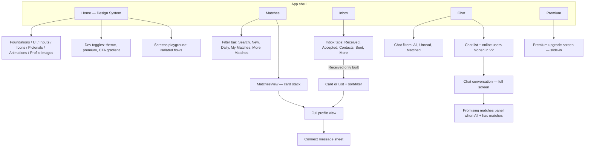
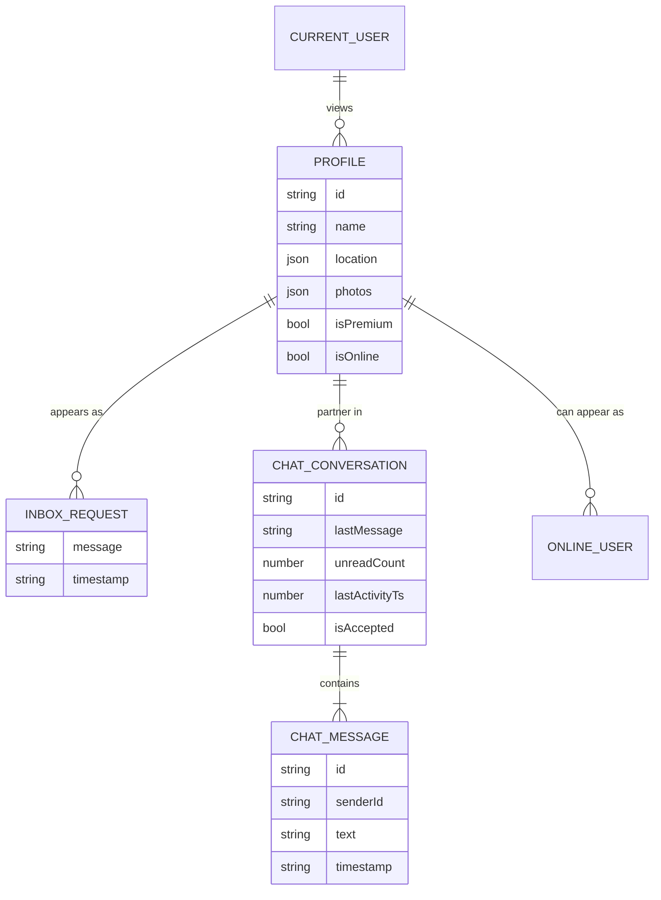

# Information architecture — Shaadiproto (MeowUI)

This document maps how the prototype is organized: primary destinations, overlays, data the UI is built around, and how users move between areas. It reflects the React single-page app in `src/app/App.tsx` (client-side state only; there is no URL-based router).

---

## 1. Product shape at a glance

| Layer | What it is |
|--------|------------|
| **Shell** | Mobile-framed layout (`MobileWrapper`), top header, bottom tab bar (hidden on Premium tab and when a chat thread is open). |
| **Primary nav** | Five bottom tabs: Home, Matches, Inbox, Chat, Premium. |
| **Secondary nav** | Filters, chips, inbox sub-tabs, drawer menu, design-system sections (Home tab). |
| **Overlays** | Full-screen or sheet flows that stack above the shell (profile detail, chat thread, premium upsell, connect message sheet, filter sheets, edit profile). |

---

## 2. Primary navigation (site map)

---

## 3. Tab-by-tab detail

### Home (`activeMainTab === 'home'`)

Serves as the **design system and prototype lab**, not a consumer “home feed.”

| Area | Contents |
|------|-----------|
| **Menu** | Cards into Foundations, UI Kit, Inputs, Pictorials, Icons, Profile Images, Animations; toggles for dark mode, mock premium tier, Connect CTA gradient (green vs pink). |
| **Foundations** | Typography scale, color tokens, gradients (Connect, SIA, logo). |
| **Components** | Buttons, chips, select-chip showcase. |
| **Inputs** | Form controls playground. |
| **Icons** | Tab icons and asset grid. |
| **Pictorials** | `PictorialsShowcase`. |
| **Profile images** | `ProfileImagesShowcase`. |
| **Animations** | Motion / SIA logo variants. |
| **Screens (WIP)** | Shortcuts that set `activeScreen` to isolated flows (see §5). |

### Matches (`activeMainTab === 'matches'`)

| Element | Role |
|---------|------|
| **Filter bar** | Segments: Search (opens inline search), New, Daily, My Matches, More Matches; filter affordance opens **shared filter bottom sheet** (partner-preference style). |
| **Main surface** | `MatchesView` — swipe/stack interaction; excludes profiles already in active chats. |
| **Connect** | Opens **ConnectMessageSheet** (SIA-style compose); can jump to **FullProfileView** via “view profile.” |
| **Full profile** | Full-screen profile with connect path; uses filtered profile list from matches (or inbox pool when opened from Inbox). |

### Inbox (`activeMainTab === 'inbox'`)

| Element | Role |
|---------|------|
| **Tabs** | Received · Accepted · Contacts · Sent · More — **only Received** has full UI; others show “Coming soon.” |
| **Received** | `InboxSubHeader`: sort (recommended, newest, oldest, recently active — premium-gated on “recently active”), card/list toggle, quick chips, full filter sheet. |
| **Views** | `InboxReceivedView` (swipe cards) or `InboxListView`. |
| **Actions** | Accept / decline requests; view profile opens **FullProfileView** (inbox profile set). Accept can create or update **chat conversations**. |

### Chat (`activeMainTab === 'chat'`)

| Element | Role |
|---------|------|
| **Filters** | All · Unread · Matched. |
| **List** | `ChatListView` with merged mock + accepted conversations, sorted by last activity; “online users” strip is off in this build. |
| **Thread** | `ChatConversationScreen` slides in; supports messaging, connection status, connect/accept/decline from chat. |
| **Promising matches** | `PromisingMatchesPanel` when filter is All, no thread open, and there are promising matches; variant controlled via header bell on Chat (see §4). |
| **Experiment modal** | `PromisingMatchesControllerModal` — UI variants for promising matches and conversation starters. |

### Premium (`activeMainTab === 'premium'`)

Full-screen **`PremiumUpgradeScreen`** slides over the app; **bottom nav is hidden**. Back returns to the previously selected tab.

---

## 4. Global chrome and entry points

| Control | Behavior |
|---------|----------|
| **Hamburger** | Opens **SideDrawer** (profile header, premium row, menu rows, legal/support links). **Edit Profile** closes drawer and sets `activeScreen === 'edit_profile'`. |
| **Header title** | Reflects current tab: Home, Matches, Inbox, Chat, Premium. |
| **Notification icon** | On **Chat**: opens promising-matches controller modal. Elsewhere: opens **ExperimentSettingsPanel** (persona, filter iteration, inbox simulation, premium presentation options). |
| **PWA** | `PWAInstallPrompt` may appear at top when installable. |

### Side drawer (information destinations)

- Profile summary + **Edit Profile**
- **Get / Renew Premium** (visual row; prototype)
- **Partner Preferences**
- **Privacy & Settings**
- **VIPSHAADI**
- **AstroChat**
- Footer: Be Safe Online, Help & Support, Rate the App / Privacy Policy, Terms & Conditions  

*(Rows are presentational in the prototype; most do not navigate to separate implemented screens.)*

---

## 5. Standalone full-screen flows (`activeScreen`)

These replace the whole framed app until dismissed (except **edit_profile**, which is an overlay on the main shell).

| Screen key | Component | Typical entry |
|------------|-----------|----------------|
| `profile_card` | `ProfileCardScreen` | Home → Screens |
| `onboarding` | `OnboardingScreen` | Home → Screens; → `profile_for` on sign up |
| `profile_for` | `ProfileForScreen` | After onboarding |
| `registration` | `RegistrationFlow` | After profile-for |
| `connect_message` | `ConnectMessageScreen` | Home → Screens |
| `sia_onboarding` / `sia_onboarding_2` | `SiaOnboardingScreen` | Home → Screens; completion can slide **Premium** over |
| `premium_upgrade` | `PremiumUpgradeScreen` | Home → Screens |
| `chat_version_one` | Legacy **Chat V1** list (frozen baseline) | Home → Screens |
| `edit_profile` | `EditProfileView` | Drawer → Edit Profile (overlay, not full replace) |

---

## 6. Overlays and sheets (stacking model)

Rough order from base upward:

1. Main content (tab)
2. **SharedFilterBottomSheet** (matches or inbox)
3. **ConnectMessageSheet** (when connecting from matches/full profile)
4. **Premium** slide-in from filters (`showPremiumFromFilters`)
5. **SideDrawer** / **ExperimentSettingsPanel** / **PromisingMatchesControllerModal**
6. **Chat conversation** full-screen (`activeChatConversation`)
7. **Edit profile** slide-in
8. **Premium tab** full-screen

---

## 7. Content types and relationships

The UI is driven by **mock data** modules, not a live API.

| Module / type | Location | Notes |
|---------------|----------|--------|
| `Profile` | `src/types/profile.ts` / `ProfileCard` types | Rich matrimony-style fields (family, astro, verification, etc.). |
| `MOCK_PROFILES` + segment lists | `src/data/mockProfiles.ts` | Pools for daily, new, matches, inbox indices, chat seeds. |
| `InboxRequest` | `mockInboxRequests.ts` + inbox components | Profile + connect message + timestamp. |
| `ChatConversation`, `ChatMessage`, `OnlineUser` | `src/data/mockChats.ts` | V1 frozen list + V2 default conversations + helpers to create convos from accept/online. |
| `CURRENT_USER` | `src/data/currentUser.ts` | Drawer header and persona experiments. |

---

## 8. Cross-cutting filter model

**Partner preference filters** are shared conceptually between Matches and Inbox (`sharedFilters.ts`, `SharedFilterBottomSheet`): religion, income, location, verified, photos, etc., with **premium-gated** rows and configurable presentation via the experiment panel.

---

## 9. Deep-link / capture hooks

| Query / flag | Effect |
|--------------|--------|
| `?figmaCaptureInboxSortOpen=1` | On load: land on **Inbox** tab and open sort menu (for design snapshots). |

---

## 10. File map (where IA is implemented)

| Concern | Primary files |
|---------|----------------|
| Navigation state & composition | `src/app/App.tsx` |
| Bottom tabs & header | `src/app/App.tsx` |
| Matches | `src/app/components/matches/MatchesView.tsx`, `ProfileCard.tsx`, `FullProfileView.tsx`, `ConnectMessageSheet.tsx` |
| Inbox | `src/app/components/inbox/*` |
| Chat | `src/app/components/chat/ChatListView.tsx`, `ChatConversationScreen.tsx`, `PromisingMatches.tsx` |
| Standalone screens | `src/app/components/screens/*.tsx` |
| Drawer | `src/app/components/SideDrawer.tsx` |
| Filters | `src/app/components/filters/sharedFilters.ts`, `SharedFilterBottomSheet.tsx` |
| Experiments | `src/app/components/ExperimentSettingsPanel.tsx` |

---

*Generated from the codebase structure. Update this document when you add routes, tabs, or major overlays.*
