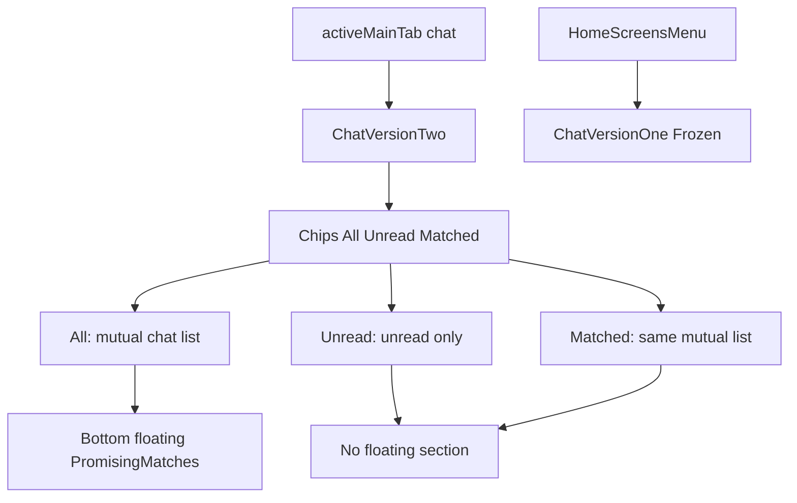

# Chat V1 / V2 Rollout Plan

## Scope

- Keep top navigation and bottom tab bar unchanged in both versions.
- Freeze current chat UI as `Chat Version One` and expose it under Home > Screens.
- Make the current Chat tab become `Chat Version Two` and apply the requested UI/data behavior there only.

## Files To Update

- `src/app/App.tsx`
- `src/app/components/chat/ChatListView.tsx`
- `src/data/mockChats.ts`
- `src/data/mockProfiles.ts`

## Implementation Steps

1. Introduce explicit V1/V2 chat rendering boundaries.
- In `App.tsx`, add a dedicated Home > Screens entry for `Chat Version One` using `activeScreen` flow.
- Build `Chat Version One` from the current chat tab behavior (existing chips set, current list behavior) so it remains a frozen reference.
- Keep the live `activeMainTab === 'chat'` path as `Chat Version Two`.

2. Update Chat Version Two chips.
- Replace chip set with: `All`, `Unread`, `Matched`.
- Remove `Shaddi live` and `Calls` from V2 only.
- Keep `Unread` behavior as unread filtering on conversations.
- Keep `Matched` conversation rows same as mutual-chat list (same baseline rows as `All`, minus All-only extras).

3. Remove online avatar carousel from V2.
- In `ChatListView.tsx`, gate or remove `OnlineUsersRow` for V2.
- Ensure the vertical chat list starts directly beneath chips in V2.
- Preserve V1 behavior unchanged.

4. Expand initial recent chats to 11 in V2.
- Seed/compose V2 chat conversations to show 11 default items.
- Do not alter More Matches definitions just to reach 11.
- Ensure row content uses production-like realistic names/messages/timestamps.

5. Add All-only floating Promising Matches section in V2.
- Show a bottom-floating section only when V2 chip is `All`.
- Hide this section on `Unread` and `Matched`.
- Populate with request/inbox-style profiles.
- Position it above bottom tab bar with safe spacing so no overlap with system navigation.

6. Keep navigation chrome untouched.
- Do not modify top bar (hamburger/chat/search/bell) or bottom tabs.
- Validate both V1 screen and V2 tab preserve existing chrome.

## Interaction/Data Flow

## Validation Checklist

- Home > Screens contains `Chat Version One` and opens correctly.
- Current Chat tab behaves as `Chat Version Two`.
- V2 chips are exactly `All`, `Unread`, `Matched`.
- V2 has no online avatar/story row.
- V2 recent chats render 11 items by default.
- Floating Promising Matches appears only on `All`.
- Top and bottom navigation remain unchanged.
